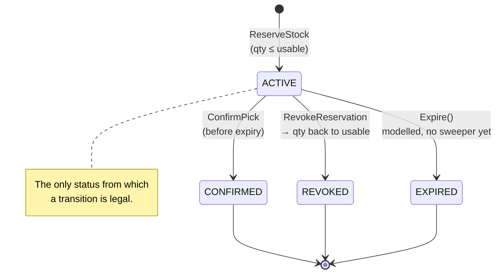

# Why Revocable Reservations

> A **Reservation** is a REVOCABLE binding of a quantity to demand, with a
> timeout. Physical delivery can fail (pod blocked, tote lost, chute jam, short
> pick), so a reservation must be releasable and re-allocatable against a
> different holding.

That sentence from `CLAUDE.md` is the whole design. This page is why it reads
that way.

## The failure it is built to prevent

Consider the obvious alternative — allocation as a hard binding: order 42 is
allocated 6 units of `SKU-1` from `StockUnit` X in bin `A-1-1`, permanently,
until the pick completes.

Now the pick fails. Pick failures are not exceptional in a fulfillment centre;
they are routine:

- the pod carrying `A-1-1` is blocked or out of service,
- the tote is lost between pick and pack,
- the chute jams,
- the picker short-picks — 4 units present where the system said 6,
- the units are physically there but damaged.

Under hard allocation, order 42 now holds a claim that can never be satisfied,
and — worse — **no other order can use that stock either**, because it is
allocated. The order is *stranded*. Getting out of that state requires an
out-of-band correction: an operator cancels the allocation, someone re-runs
allocation, and in the meantime the SLA burns.

The reference model is unambiguous that physical execution fails constantly and
plans get recomputed at every step. An inventory model whose happy path assumes
delivery succeeds is the wrong model.

## The design

Three properties, together:

### 1. Revocable

`RevokeReservation` returns quantity to usable, exactly, to the `StockUnit`s it
came from:

```go
// reservation.Revoke() — the aggregate refuses a second resolution
func (r *Reservation) Revoke() error {
	if r.status != StatusActive {
		return ErrAlreadyResolved
	}
	r.status = StatusRevoked
	return nil
}
```

The use case then walks the reservation's `Allocation`s and calls
`ReleaseReservation` on each `StockUnit`. Usable goes back up; the stock is
immediately available to a different demand.

### 2. Expiring

Every reservation carries `expiresAt = createdAt + timeout`
(`DefaultReservationTimeout` is 30 minutes). Time comes from the injected
`Clock` port, never from `time.Now()` inside the aggregate, so expiry is
deterministic under test.

`Confirm` refuses an expired reservation (`ErrExpired`): you cannot confirm a
pick against a claim whose window has closed. The claim is therefore bounded —
past `expiresAt` it can no longer turn into a pick, and revoking it returns the
quantity to usable.

:::caution No expiry sweeper yet
`Reservation.Expire()` and the `ReservationExpired` event exist and are
unit-tested, but nothing calls them on a timer. Until a sweeper is added, a
timed-out reservation keeps holding quantity out of usable until something
issues `DELETE /reservations/{id}`. See
[Domain Events](/docs/ddd/domain-events) for the detail.
:::

### 3. Not bound to one physical holding

This is the subtle one, and it is what "re-allocatable against a **different**
holding" means concretely.

`ReserveStock` is **SKU-scoped**, not bin-scoped. It sums usable quantity
across every `StockUnit` for the SKU, then draws from them first-fit,
recording an `Allocation` per unit it touched:

```go
totalUsable := shared.Quantity(0)
for _, unit := range units {
	totalUsable = totalUsable.Add(unit.Usable())
}
if qty.GreaterThan(totalUsable) {
	return nil, ErrInsufficientUsable
}
```

So a reservation for 6 units may be satisfied as 4 from bin `A-1-1` and 2 from
bin `C-9-3`. The `Allocation`s exist so that a **revoke is exact** — each unit
gets back precisely what was taken from it. But nothing constrains the *next*
reservation to those same units. Revoke, then reserve again, and the demand can
be satisfied entirely from a different floor of the building.

This is exactly where [chaotic storage](./chaotic-storage.md) pays off: because
a SKU's units are deliberately spread across many bins, "a different holding"
almost always exists.

## The lifecycle



`ACTIVE` is the only status with outgoing transitions. Every other transition
attempt returns `ErrAlreadyResolved` → `409 Conflict`. That is the
**no-double-consume** invariant: a reservation cannot be revoked twice (which
would return its quantity to usable twice, inventing stock), and cannot be both
confirmed and revoked.

## What is deliberately *not* done

- **No two-phase commit, no distributed transaction, no lock held across the
  physical operation.** The reservation *is* the compensable step; revoke is
  the compensation. A distributed lock spanning "reserve" and "the tote
  physically arrives at pack" would mean holding a lock for minutes across a
  process that fails routinely.
- **No automatic re-allocation on failure.** When a pick fails, this service
  revokes and returns stock to usable — deciding *what to do next* (re-release
  the work against a different holding, re-prioritise, split the order) is a
  WES-tier decision, and belongs to `wes-work-planning`. This context makes
  recovery *possible*; it does not make the recovery *decision*.
- **No reservation of specific bins for future demand.** That would be fixed
  slotting by another name.

## What downstream sees

`StockReserved` and `ReservationRevoked` are the two events this service
publishes to Kafka. `wes-work-planning` projects them into its own
`UsableInventoryObserved` read model, keyed by SKU: reserve decrements the
observed usable count, revoke increments it back. The revocability is
therefore visible on the wire, not just internally — the downstream read model
is designed around the assumption that reservations come back.

See [ADR 0003](/docs/adr/0003-revocable-reservations) and
[Integration](/docs/ecosystem/integration).
