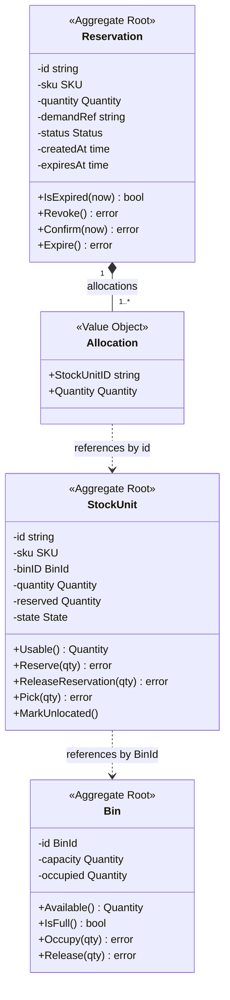
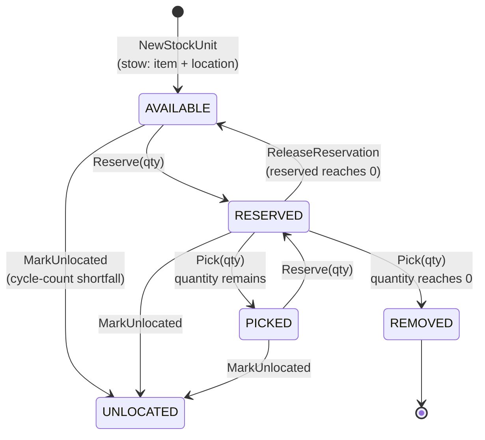

# Aggregates & Invariants

Three aggregate roots, one value-object package. Every invariant below is
enforced **in the domain layer** and has a unit test for its failing path.

Note the two dotted lines: aggregates reference each other **by identity, not
by pointer**. A `Reservation` never holds a `*StockUnit`, and a `StockUnit`
never holds a `*Bin`. Each is loaded, changed and saved through its own
repository port, which keeps transaction boundaries at one aggregate.

## StockUnit

**A quantity of a SKU at a specific bin.** The core aggregate of the context.

| Field | Meaning |
| --- | --- |
| `id` | Identity, minted by `StockRepo.NextID` |
| `sku` | Item scan |
| `binID` | Location scan |
| `quantity` | On-hand at this bin |
| `reserved` | Portion bound to demand |
| `state` | `AVAILABLE` / `RESERVED` / `PICKED` / `REMOVED` / `UNLOCATED` |

### Invariants

| # | Invariant | Enforcement | Failing-path test |
| --- | --- | --- | --- |
| S1 | **A stow requires both an item-scan and a location-scan.** | `NewStockUnit` returns `ErrStowRequiresItemAndLocation` when `sku == ""` or `binID == ""` | `TestNewStockUnit_RequiresSKU`, `TestNewStockUnit_RequiresBin` |
| S2 | **Quantity is never negative.** | `Quantity` refuses negative construction and negative arithmetic results | `TestNewQuantity_RejectsNegative`, `TestQuantity_Sub_RejectsNegativeResult` |
| S3 | **A stow of zero or fewer units is invalid.** | `NewStockUnit` returns `ErrZeroQuantity` | `TestNewStockUnit_RejectsZeroQuantity` |
| S4 | **Reserved never exceeds usable — no negative usable.** | `Reserve` returns `ErrInsufficientUsable` when `qty > Usable()` | `TestStockUnit_Reserve_ExceedsUsable_Rejected` |
| S5 | **Unlocated or removed stock is never reservable.** | `Reserve` returns `ErrUnitUnlocated`; `Usable()` returns 0 for those states | `TestStockUnit_Reserve_UnlocatedUnit_Rejected`, `TestStockUnit_Usable_RemovedState_IsZero` |
| S6 | **A pick cannot exceed what was reserved, nor what is on hand.** | `Pick` returns `ErrInsufficientReserved` | `TestStockUnit_Pick_ExceedsReserved_Rejected`, `TestStockUnit_Pick_ExceedsOnHandQuantity_Rejected` |
| S7 | **Release cannot return more than was reserved.** | `ReleaseReservation` returns `ErrInsufficientReserved` | `TestStockUnit_ReleaseReservation_ExceedsReserved_Rejected` |

### State transitions

`MarkUnlocated` is deliberately unconditional — it takes no error return. A
cycle count that finds stock missing must always be able to say so; refusing
the transition because the unit happened to be reserved would leave the system
claiming stock it cannot produce.

## Bin / Location

**A coded slot in chaotic storage.** Any SKU may occupy any free bin.

| Field | Meaning |
| --- | --- |
| `id` | Bin code, e.g. `A-1-1` |
| `capacity` | Maximum units the slot holds |
| `occupied` | Units currently stowed |

### Invariants

| # | Invariant | Enforcement | Failing-path test |
| --- | --- | --- | --- |
| B1 | **`sum(stock qty in bin) <= capacity`; a full bin rejects a stow.** | `Occupy` returns `ErrBinFull` when `occupied + qty > capacity` | `TestBin_Occupy_ExceedsCapacity_Rejected`, `TestStowStock_ExceedsBinCapacity_Rejected` |
| B2 | **Capacity must be positive.** | `NewBin` returns `ErrInvalidCapacity` for `capacity <= 0` | `TestNewBin_RejectsInvalidCapacity` |
| B3 | **A bin needs an id.** | `NewBin` returns `ErrEmptyBinID` | `TestNewBin_RejectsEmptyID` |
| B4 | **You cannot release more than is occupied.** | `Release` returns `ErrReleaseExceedsOccupancy` | `TestBin_Release_ExceedsOccupancy_Rejected` |
| B5 | **A stow of zero units is meaningless.** | `Occupy`/`Release` return `ErrZeroQuantity` | `TestBin_Occupy_RejectsZeroQuantity`, `TestBin_Release_RejectsZeroQuantity` |

The `Bin` aggregate has **no SKU field and no SKU affinity** — that absence is
the invariant that makes storage chaotic rather than fixed-slot.

## Reservation

**A revocable binding of a quantity to demand, with a timeout.**

| Field | Meaning |
| --- | --- |
| `id` | Identity, minted by `ReservationRepo.NextID` |
| `sku`, `quantity` | What is claimed |
| `demandRef` | Opaque upstream reference (order id, work-unit ref) |
| `allocations` | Which `StockUnit`s it drew from, and how much from each |
| `status` | `ACTIVE` / `CONFIRMED` / `REVOKED` / `EXPIRED` |
| `createdAt`, `expiresAt` | `expiresAt = createdAt + timeout` |

### Invariants

| # | Invariant | Enforcement | Failing-path test |
| --- | --- | --- | --- |
| R1 | **Reserved quantity ≤ usable quantity at reserve time.** | `ReserveStock` sums usable across the SKU and returns `ErrInsufficientUsable`; `StockUnit.Reserve` re-checks per unit | `TestReserveStock_ExceedsUsable_Rejected` |
| R2 | **Revoke returns quantity to usable.** | `RevokeReservation` walks `allocations` and calls `ReleaseReservation` on each unit | `TestRevokeReservation_ReturnsQuantityToUsable`, `TestStockUnit_ReleaseReservation_ReturnsToUsable` |
| R3 | **No double-consume.** | `Revoke`/`Confirm`/`Expire` return `ErrAlreadyResolved` unless status is `ACTIVE` | `TestReservation_Revoke_Twice_Rejected`, `TestReservation_Confirm_Twice_Rejected`, `TestReservation_Expire_Twice_Rejected`, `TestConfirmPick_AfterRevoke_Rejected` |
| R4 | **Expires after a timeout.** | `IsExpired(now)`; `Confirm` returns `ErrExpired` past `expiresAt` | `TestReservation_IsExpired`, `TestReservation_Confirm_AfterExpiry_Rejected` |
| R5 | **A reservation must allocate against something.** | `New` returns `ErrNoAllocations` for an empty allocation list | `TestNew_RequiresAtLeastOneAllocation` |

Time is supplied by the `Clock` port, never read inside the aggregate, so R4 is
deterministic under test. Note that `Expire()` is modelled and tested but not
yet driven by a scheduled sweeper — see
[Domain Events](./domain-events.md#one-honest-gap-nothing-sweeps-expirations-yet).

## Value objects (`internal/domain/shared`)

| Type | Rule | Errors |
| --- | --- | --- |
| `SKU` | Non-empty | `ErrEmptySKU` |
| `BinId` | Non-empty | `ErrEmptyBinID` |
| `Quantity` | Non-negative; every arithmetic operation that would go negative errors rather than clamping. `NewPositiveQuantity` also rejects zero. | `ErrNegativeQuantity`, `ErrZeroQuantity` |

`Quantity.Sub` is the workhorse of the "no negative usable" rule and is
therefore where boundary tests were added explicitly during mutation testing —
the `result < 0` boundary is the difference between refusing an impossible
operation and silently inventing stock.

## ProductClassification

**SKU-level master data, independent of any StockUnit or bin.** Added in
[ADR 0009](/docs/adr/0009-product-classification-as-sku-master-data): this
service owns product classification as source of truth and enforces
placement rules against it at stow time.

| Field | Meaning |
| --- | --- |
| `sku` | The classified SKU |
| `handlingTags` | A set drawn from the closed enum `Hazmat`/`Fragile`/`TemperatureSensitive`/`Oversized`/`HighValue` |
| `temperatureClass` | `Ambient`/`Chilled`/`Frozen` — meaningful, and required, only when `handlingTags` contains `TemperatureSensitive` |

### Invariants

| # | Invariant | Enforcement | Failing-path test |
| --- | --- | --- | --- |
| P1 | **A classification requires at least one handling tag.** | `New` returns `ErrNoHandlingTags` | `TestNew_TableDriven/no_tags_rejected` |
| P2 | **HandlingTag is a closed enum.** | `ParseHandlingTag` / `New` return `ErrUnknownHandlingTag` for anything outside the five named tags | `TestParseHandlingTag/unknown`, `TestNew_TableDriven/unknown_tag_rejected` |
| P3 | **No duplicate tags — HandlingTags is a set, not a list.** | `New` returns `ErrDuplicateHandlingTag` | `TestNew_TableDriven/duplicate_tag_rejected` |
| P4 | **TemperatureSensitive requires a valid, non-empty TemperatureClass.** | `New` returns `ErrTemperatureClassRequired` (missing) or `ErrUnknownTemperatureClass` (invalid) | `TestNew_TableDriven/temperature_sensitive_without_class_rejected` |
| P5 | **Absence of TemperatureSensitive means TemperatureClass must be empty.** | `New` returns `ErrTemperatureClassNotApplicable` | `TestNew_TableDriven/temperature_class_without_temperature_sensitive_tag_rejected` |

`ProductClassified(sku, tags, temperatureClass, occurredAt)` is raised on
every construction/replacement — see
[Domain Events](./domain-events.md).

*Code:* `internal/domain/product.ProductClassification`

## The four named invariants

`CLAUDE.md` singles out four as the Definition of Done for the context. Each
has a dedicated failing-path test:

| Invariant | Domain test | Use-case test |
| --- | --- | --- |
| Bin-capacity rejection | `TestBin_Occupy_ExceedsCapacity_Rejected` | `TestStowStock_ExceedsBinCapacity_Rejected` |
| Stow requires item + location | `TestNewStockUnit_RequiresSKU` / `_RequiresBin` | — |
| Reservation ≤ usable | `TestStockUnit_Reserve_ExceedsUsable_Rejected` | `TestReserveStock_ExceedsUsable_Rejected` |
| Revoke returns to usable | `TestStockUnit_ReleaseReservation_ReturnsToUsable` | `TestRevokeReservation_ReturnsQuantityToUsable` |

All four are additionally covered as black-box Gherkin scenarios under
`features/`, driven through the real HTTP router.
