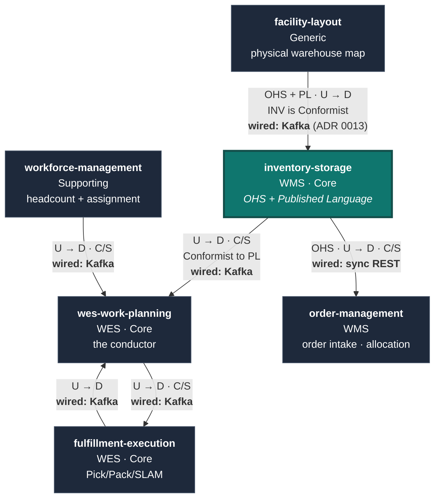

# Bounded-Context Relationships

This page is the *strategic* view — the DDD relationship patterns. The
*technical* view (topics, envelopes, payloads) is on the
[Ecosystem](/docs/ecosystem/context-map) pages.

## Pattern vocabulary

Using the patterns as `warehouse-systems-ddd.md` and
`amazon-fulfillment-ddd.md` use them:

| Pattern | Meaning |
| --- | --- |
| **OHS** — Open Host Service | A context exposes a well-defined, public protocol for many consumers, rather than a bespoke integration per consumer. |
| **PL** — Published Language | The shared, documented vocabulary that protocol speaks (here: the REST DTOs + the event catalog). |
| **C/S** — Customer/Supplier | Upstream supplies something downstream needs; downstream's needs have standing with upstream. |
| **CF** — Conformist | Downstream accepts upstream's model as-is, with no translation leverage. |
| **ACL** — Anti-Corruption Layer | Downstream translates upstream's model into its own, so upstream concepts never leak inward. |

## This context's role: **Open Host Service, upstream**

`inventory-storage` is an **Open Host Service** for two things:

1. **bin-accurate location** — where stock physically is, and
2. **usable inventory** — what portion of it can be promised.

Its **Published Language** has two surfaces:

- **REST** (`apis/openapi.yaml`) — synchronous queries and commands.
- **Events** (`apis/asyncapi.yaml`, topic `warehouse.inventory.events`) —
  asynchronous facts.

Both are versioned, Spectral-linted artefacts in the repository, not
implementation details. That is what makes it an *Open Host* Service rather
than a set of point-to-point integrations: a sixth consumer could arrive
tomorrow and integrate from the published spec without this repo changing.

The reference model states the position directly:

> **Planning ↔ Inventory & Storage:** Customer/Supplier. Planning asks "can I
> allocate?"; Inventory is the authoritative supplier of stock + bin location
> (its Open-Host Service exposes bin-accurate location as Published Language).

## The map

Every edge above is implemented today. Arrows point upstream → downstream,
not in the direction of the network call: `order-management` *calls* this
service, but it is the downstream customer of this service's REST OHS.
`wes-work-planning` and `fulfillment-execution` also read
`GET /products/{sku}/classification` synchronously — the same OHS, omitted
from the diagram for legibility; see the
[Context Map](/docs/ecosystem/context-map) for every wire.

## Relationship by relationship

### inventory-storage → wes-work-planning — **Customer/Supplier, Conformist downstream**

The only consumer of this service's integration events.

- **Direction:** upstream (supplier). This service publishes; Work Planning
  consumes.
- **Pattern:** Customer/Supplier with Work Planning as a **Conformist** to this
  service's Published Language. It takes `StockReserved` /
  `ReservationRevoked` in the shape they are published and projects them into
  its own `UsableInventoryObserved` read model keyed by SKU — it does not
  negotiate the shape, and it does not get write access.
- **Why no write access:** `warehouse-systems-ddd.md` is explicit — "WES does
  **not** get write access to WMS's Order/Inventory aggregates — only to the
  published events/API." Reserving stock is a `POST /reservations` call against
  this service's own API, which runs this service's own invariants. There is no
  path by which a WES-tier service can mutate a `StockUnit` directly.
- **The ACL runs in both directions.** This context never learns what a "work
  unit," a "CPT," a "process path" or a "station" is. Work Planning never
  learns what a `StockUnit`, a `Bin` or an `Allocation` is — it holds only an
  observed usable count per SKU. That mutual ignorance is the boundary working.

### inventory-storage ↔ fulfillment-execution — **indirect, via Work Planning**

There is **no event wiring** between these two. `fulfillment-execution`
consumes `warehouse.work-planning.events` (`WorkReleased`) and publishes
`warehouse.fulfillment.events`; it does not subscribe to
`warehouse.inventory.events`, and this service does not subscribe to its
topic. Its one call into this service is a read of this service's product
classification master data (`GET /products/{sku}/classification`).

Strategically that is right: `fulfillment-execution` owns the *task* lifecycle
and needs work to do, not stock truth. The accounting consequence of a pick
reaches this service as an explicit `POST /reservations/{id}/confirm-pick`
call, which is a deliberate command, not an event this service happens to
overhear. (No sibling repository issues that command today.)

### inventory-storage ↔ workforce-management — **no relationship**

Labour planning and inventory truth share no concepts. `workforce-management`
publishes `ShiftPlanCommitted` on `warehouse.workforce.events`, consumed by
Work Planning only. Keeping these two contexts unrelated is the concrete form
of the rule that worker identity must not leak into the system of record.

### inventory-storage ← facility-layout — **Conformist, wired over Kafka**

`facility-layout` is a **Generic subdomain** and an **Open Host Service** for
physical warehouse structure: `Site → Area → Zone → Aisle → Bay → Level →
Position`, `LocationType`, `PlacementRule`, `LocationSlot`. Its own `CLAUDE.md`
positions the other services — this one included — as downstream
**Conformists** to whatever it publishes.

This service now conforms to it in code. With `LOCATION_LOOKUP_MODE=kafka`
(what the `warehouse-infra` cluster runs), `internal/adapters/outbound/facilitycache`
consumes `warehouse.facility.events` — `ZoneRegistered`,
`LocationSlotRegistered`, `LocationSlotDecommissioned`, taken in
`facility-layout`'s own shape with no translation layer — into a local,
in-memory read model of zone hazmat rating and temperature class per location
code ([ADR 0013](/docs/adr/0013-location-classification-via-facility-events)).
`StowStock` reads that model to enforce ADR 0009's hazmat/temperature
placement rules for classified SKUs. The synchronous
`GET /locations/{locationCode}/classification` call ADR 0009 first
introduced survives as `LOCATION_LOOKUP_MODE=http`, the rollback.

What is still **not** built, and remains the intended shape:

- `facility-layout` as the source of truth for whether a `BinId` is a real,
  active, correctly-typed slot — `StowStock` still only checks that the bin
  exists in this service's own `LocationRepo`;
- placement policy beyond hazmat and temperature class (size fit, the
  `Oversized`/`HighValue`/`Fragile` tags) — none of it is enforced, and when
  it is, the policy belongs in `facility-layout`'s `PlacementRule` model, not
  here; that would be re-introducing fixed slotting through the back door.

A `Bin` in this context remains an id, a capacity and an occupancy, seeded as
infrastructure data.

### order-management → inventory-storage — **Customer/Supplier, synchronous**

`order-management` is a downstream **customer** of this service's REST Open
Host Service: order allocation reserves stock with `POST /reservations`,
cancellation revokes it with `DELETE /reservations/{id}`, and order intake
reads `GET /products/{sku}/classification`. Every call runs through this
service's own invariants; order management gets no write access to a
`StockUnit`, and the edge is gated on its side by `INVENTORY_STORAGE_MODE` /
`PRODUCT_CLASSIFICATION_MODE` (both defaulting to a no-network `permissive`
stub).

## Disciplines this map enforces

From `warehouse-systems-ddd.md`, applied literally in this repository:

1. **No shared aggregates across contexts.** No Go type in this module is
   imported by any sibling; no sibling type is imported here. Integration is
   JSON over Kafka and HTTP.
2. **Same word, different model is allowed.** "Location," "Reservation" and
   "Pick" all mean different things one service over — see the
   [Ubiquitous Language](/docs/business-context/ubiquitous-language) table.
3. **Model synchronization explicitly.** Fan-in across concurrent work
   (`OrderConvergence`) is a WES concern and is *absent* here by design; this
   context has no cross-order coordination concept at all.
4. **Classify strategically before modelling tactically.** Core classification
   is what justifies the domain-purity rules and the quality bar; it is also
   what justifies *not* building a facility-layout model here just because it
   would be convenient.
