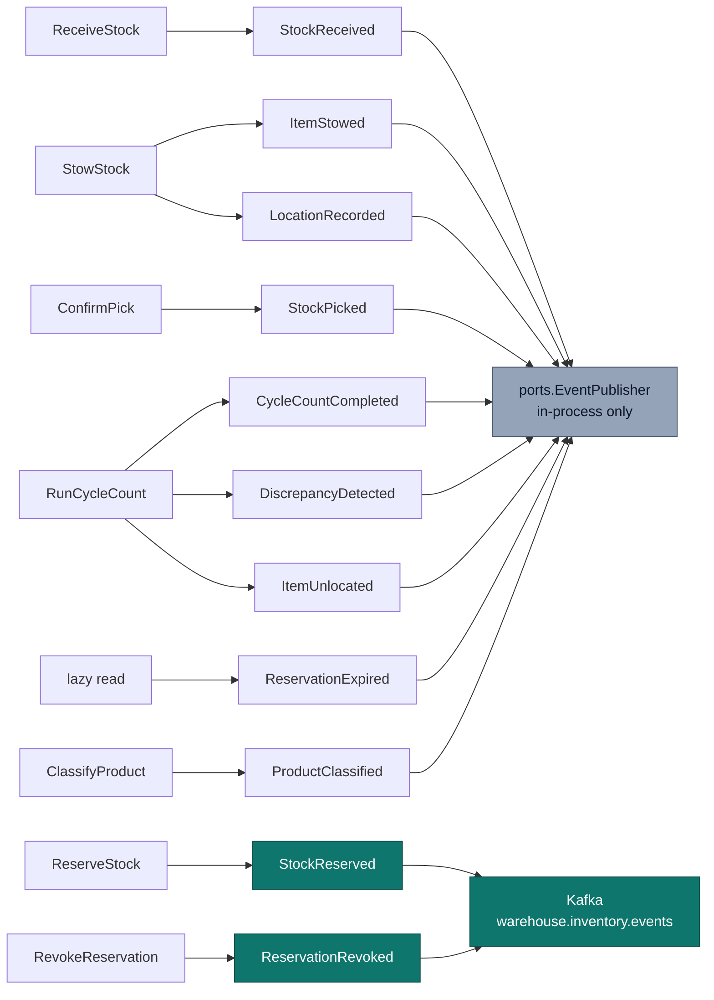

# Domain Events

Eleven past-tense events, raised by four aggregates. Every event carries an
`occurredAt` taken from the injected `Clock` port — never wall-clock time at
publish — so ordering is a domain fact rather than an infrastructure artefact.

```go
// internal/domain/shared/events.go
type DomainEvent interface {
	EventName() string
	OccurredAt() time.Time
}
```

The domain never depends on the publishing mechanism. Use cases hand events to
`ports.EventPublisher`; which adapter is behind it (log, buffered, Postgres
table, Kafka) is a composition-root decision.

## The catalog

| Event | Raised by | Raised when | Payload |
| --- | --- | --- | --- |
| `StockReceived` | StockUnit *(pre-location)* | `ReceiveStock` acknowledges inbound goods | `sku`, `quantity` |
| `ItemStowed` | StockUnit | `StowStock` succeeds — item-scan + location-scan both present | `sku`, `binId`, `quantity` |
| `LocationRecorded` | StockUnit | Immediately after `ItemStowed`; the bin now authoritatively holds this unit | `stockUnitId`, `binId` |
| `StockReserved` | Reservation | `ReserveStock` succeeds | `reservationId`, `sku`, `quantity`, `demandRef` |
| `ReservationExpired` | Reservation | A reservation's timeout elapses and is discovered at the next read (`GetReservationsByDemandRef`, `RevokeReservation`, `ConfirmPick`, or `ReserveStock`'s own idempotency lookup) — **lazy, not swept**, see below | `reservationId` |
| `ReservationRevoked` | Reservation | `RevokeReservation` succeeds | `reservationId` |
| `StockPicked` | Reservation | `ConfirmPick` consumes a reservation | `reservationId`, `sku`, `quantity` |
| `ItemUnlocated` | StockUnit | A cycle-count shortfall cannot account for stock | `stockUnitId`, `sku`, `binId`, `quantity` |
| `CycleCountCompleted` | Bin | Any cycle count finishes, clean or not | `binId`, `countedQty`, `systemQty`, `discrepancy` |
| `DiscrepancyDetected` | Bin | A cycle count finds counted ≠ system | `binId`, `countedQty`, `systemQty` |
| `ProductClassified` | ProductClassification | `ClassifyProduct` registers or replaces a SKU's classification | `sku`, `handlingTags`, `temperatureClass`, `dotHazardClass` |

## Which events flow where



**Only `StockReserved` and `ReservationRevoked` cross the service boundary
today.** The Kafka adapter's `switch` has a `default: return nil` branch that
silently drops everything else — that is deliberate, not an oversight: those
two are the published integration contract, and the other nine (including
`ProductClassified`) are local concerns. `apis/asyncapi.yaml` documents the
full catalog and marks each catalog-only message as such, so a downstream
team cannot mistake a documented event for a wired one.

## Lazy expiry: no sweeper, resolved at the next read

`ReservationExpired` and `Reservation.Expire()` exist in the domain and are
unit-tested, and **are now genuinely raised** — but not by a background
sweeper. The decision (2026-09-26, see [ADR 0003](/docs/adr/0003-revocable-reservations))
is **lazy expiry**: a timed-out reservation is discovered and resolved the
next time it is read, not on a schedule. Every read path that can return a
`Reservation` runs the same check first — `GetReservationsByDemandRef`,
`RevokeReservation`, `ConfirmPick`, and `ReserveStock`'s own idempotency
lookup — so there is no window where a stale `ACTIVE` reservation can be
returned to a caller:

- if the reservation is `ACTIVE` and past `expiresAt`, the read transitions
  it to `EXPIRED`, returns its allocated quantity to the owning `StockUnit`'s
  usable pool, persists both changes, and publishes `ReservationExpired`
  through the same `ports.EventPublisher` every other domain event uses —
  all before the read returns;
- if it is already `EXPIRED`, `CONFIRMED`, or `REVOKED`, the read is a no-op:
  the event is never raised twice for the same reservation;
- `Reservation.Confirm(now)` still independently returns `ErrExpired` past
  `expiresAt` as a second line of defence — but by the time `ConfirmPick`
  reaches that call, the lazy-expiry check on its own read has usually
  already resolved the reservation to `EXPIRED`, so the caller sees
  `ErrAlreadyResolved` instead.

The practical consequence: a reservation nobody revokes still holds quantity
out of usable until it is *read* — there remains no proactive reclaim of
quantity for a reservation that both times out **and** is never looked up
again. That is judged an acceptable trade-off for this service's read
volume; if it stops being one, the fix is a scheduled read (e.g. a periodic
call to `GetReservationsByDemandRef` or a dedicated sweep use case), not a
change to the lazy check itself. `apis/asyncapi.yaml` documents
`ReservationExpired`'s payload; it reaches the analytics topic
(`warehouse.inventory.analytics`) the same way `ReservationRevoked` does, via
`kafka/analytics_publisher.go`.

## Naming conventions

Two conventions coexist, and the difference is worth understanding.

### In-process: bare past-tense names

`shared.DomainEvent.EventName()` returns the bare name — `"StockReserved"`,
`"ItemStowed"`. That is the domain's own vocabulary and it deliberately carries
no transport or platform naming.

### On the wire: reverse-DNS CloudEvents `type`

The platform-wide convention, shared across the fleet's services:

```text
com.warehouse.<subdomain>.<bounded-context>.<entity>.<EventName>
```

All lowercase except the final PascalCase event name. For this context the
subdomain segment is `wms` and the bounded context is `inventory-storage`:

```text
com.warehouse.wms.inventory-storage.stock.ItemStowed
com.warehouse.wms.inventory-storage.reservation.ReservationRevoked
com.warehouse.wms.inventory-storage.bin.CycleCountCompleted
```

Entity segments group by the aggregate that raises the event: `stock`,
`reservation`, `bin`.

`StockPicked` is grouped under `reservation` rather than `stock`, because it is
emitted by `ConfirmPick` when a reservation is consumed and the reservation id
is the only identity it carries.

## What the Kafka adapter actually emits today

There is a documented gap between the target envelope and the shipped one, and
it is stated in `apis/asyncapi.yaml` rather than papered over. The adapter
currently writes the **legacy flat warehouse envelope**:

```json
{
  "event_id": "9f1c...-uuid-v4",
  "event_type": "StockReserved",
  "occurred_at": "2026-08-21T22:00:00Z",
  "source": "inventory-storage",
  "data": { "sku": "SKU-1", "quantity": 6, "demand_ref": "order-42" }
}
```

The `data` payloads for `StockReserved` and `ReservationRevoked` match the
AsyncAPI document field-for-field; the surrounding CloudEvents context
attributes (`specversion`, `id`, `source`, `type`, `subject`, `time`,
`datacontenttype`) describe the target envelope the platform is standardising
on. See the [Events page](/docs/api-reference/events) for both shapes in full,
and [ADR 0004](/docs/adr/0004-kafka-integration-events) for the decision.

## A detail worth knowing: `ReservationRevoked` enrichment

The domain event `ReservationRevoked` carries only a `reservationId` — the
aggregate has no reason to repeat data the reservation already holds. But the
integration contract promises `{sku, quantity, demand_ref}`, because the
downstream projection is keyed by SKU and cannot do a lookup.

The Kafka adapter bridges that gap by re-reading the reservation through
`ReservationRepo` at publish time:

```go
case shared.ReservationRevoked:
	res, err := p.reservations.FindByID(ctx, e.ReservationID)
	if err != nil { return err }
	if res == nil { return ErrReservationNotFound }
	data = reservationData{SKU: res.SKU().String(), Quantity: res.Quantity().Int(), DemandRef: res.DemandRef()}
```

This is the right place for it: enrichment for a downstream consumer's
convenience is an **adapter** concern, and putting the extra fields on the
domain event to save a lookup would let an integration requirement leak into
the domain model. The use case saves the reservation before publishing, so the
lookup always succeeds; `ErrReservationNotFound` exists as a guard, not as an
expected path.

## Read models are projections

`CLAUDE.md` states it as a rule: read models (usable-by-SKU, bin occupancy) are
**projections from events**, not separately-maintained aggregates. Inside this
service, `GetUsable` projects from `StockUnit`s at read time. Across the
boundary, `wes-work-planning` projects `StockReserved` / `ReservationRevoked`
into its own `UsableInventoryObserved` read model keyed by SKU. Same discipline,
two scopes.
