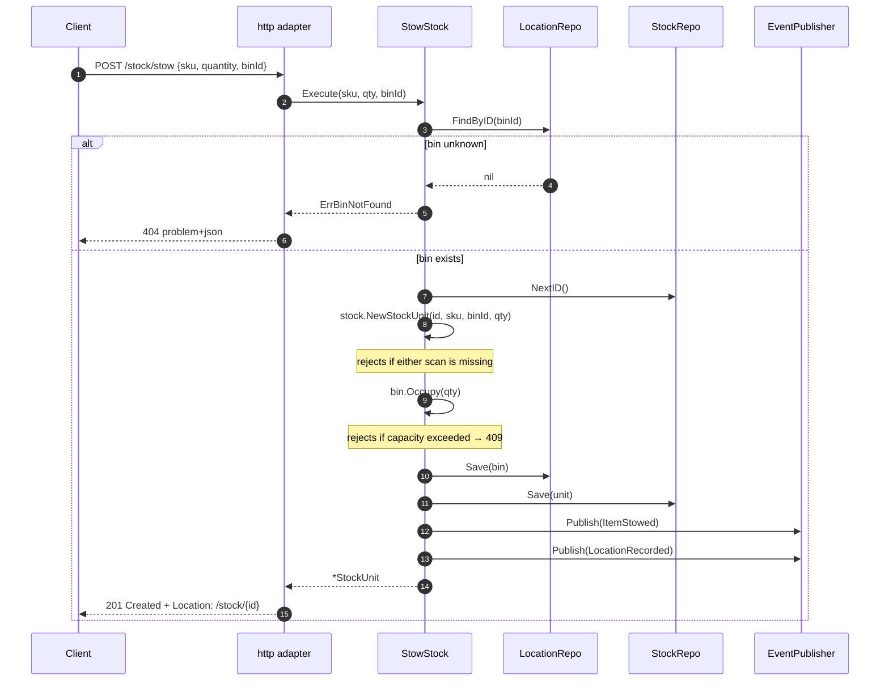
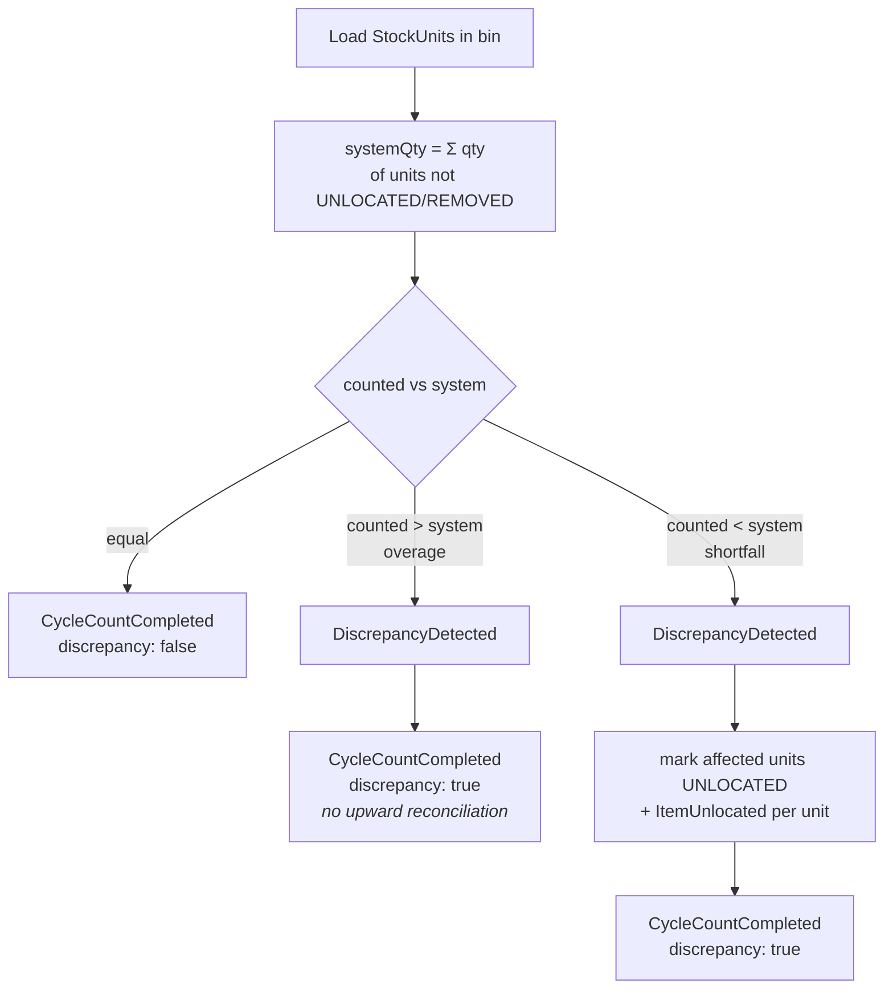

# Use Cases

Seven use cases, one struct each, in `internal/application/usecases`. Each
depends only on the domain and on `application/ports` — never on an adapter.
Dependencies are plain struct fields, wired once in
`cmd/inventory/main.go`.

| # | Use case | HTTP | Emits |
| --- | --- | --- | --- |
| 1 | `ReceiveStock` | `POST /stock/receive` | `StockReceived` |
| 2 | `StowStock` | `POST /stock/stow` | `ItemStowed`, `LocationRecorded` |
| 3 | `ReserveStock` | `POST /reservations` | `StockReserved` |
| 4 | `RevokeReservation` | `DELETE /reservations/{id}` | `ReservationRevoked` |
| 5 | `ConfirmPick` | `POST /reservations/{id}/confirm-pick` | `StockPicked` |
| 6 | `GetUsable` | `GET /inventory/{sku}/usable` | — (read model) |
| 7 | `RunCycleCount` | `POST /bins/{binId}/cycle-count` | `CycleCountCompleted`, `DiscrepancyDetected`, `ItemUnlocated` |

## 1. ReceiveStock(sku, qty)

Acknowledges that goods arrived against a SKU and are staged, awaiting stow.

**Collaborators:** `EventPublisher`, `Clock`. Notably **no repository** — a
receipt creates no `StockUnit`, because nothing has been located yet. Under
chaotic storage, un-located stock is not yet part of the ledger.

**Returns** a `StagedReceipt` value (`sku`, `quantity`, `receivedAt`), which is
why the endpoint answers `202 Accepted` and not `201 Created`: there is no
addressable resource to point a `Location` header at. The addressable resource
— a `StockUnit` — is created later, at stow.

**Fails when:** SKU is empty (400), quantity ≤ 0 (422).

## 2. StowStock(sku, qty, binId)

The operation that brings a `StockUnit` into existence. Validates item-scan +
location-scan and respects bin capacity.

**Collaborators:** `StockRepo`, `LocationRepo`, `EventPublisher`, `Clock`.

**Ordering matters:** the aggregate is constructed *before* the bin is
occupied, so an invalid stow never mutates bin occupancy. Bin and unit are then
saved together, bin first.

**Fails when:** bin unknown (404), missing scan (400), quantity ≤ 0 (422), bin
full (409).

## 3. ReserveStock(sku, qty, demandRef)

Creates a revocable `Reservation` against **usable** inventory, drawing
first-fit across the SKU's `StockUnit`s.

**Collaborators:** `StockRepo`, `ReservationRepo`, `EventPublisher`, `Clock`,
plus a `Timeout` (defaults to `DefaultReservationTimeout`, 30 minutes).

The algorithm:

1. Load every `StockUnit` for the SKU.
2. Sum `Usable()` across them; if the request exceeds the sum, fail early with
   `ErrInsufficientUsable` — **before** mutating anything.
3. Walk the units, taking `min(remaining, unit.Usable())` from each, recording
   an `Allocation{StockUnitID, Quantity}` per unit touched.
4. Save every touched unit, mint a reservation id, construct the
   `Reservation` with `expiresAt = now + timeout`, save it.
5. Publish `StockReserved`.

A single reservation therefore **may span multiple bins** — covered by
`TestReserveStock_SpansMultipleStockUnits`. That is the point: SKU-scoped
allocation is what makes a later revoke re-satisfiable from a different
holding.

**Fails when:** quantity ≤ 0 (422), usable insufficient (409), SKU has no stock
at all (409).

## 4. RevokeReservation(reservationId)

Cancels a reservation and returns its quantity to usable.

**Collaborators:** `StockRepo`, `ReservationRepo`, `EventPublisher`, `Clock`.

It calls `Reservation.Revoke()` (which refuses anything not `ACTIVE`), then
walks the recorded `Allocation`s and calls `StockUnit.ReleaseReservation(qty)`
on each — exact, per-unit restitution — saving each unit and finally the
reservation, then publishes `ReservationRevoked`.

**Fails when:** reservation unknown (404), already confirmed/revoked/expired
(409 `ErrAlreadyResolved`), a referenced stock unit is missing (404).

## 5. ConfirmPick(reservationId)

Consumes the reservation: the stock physically left the bin.

**Collaborators:** `StockRepo`, `LocationRepo`, `ReservationRepo`,
`EventPublisher`, `Clock`.

Unlike revoke, this touches **three** aggregates. For each allocation it calls
`StockUnit.Pick(qty)` — which decrements both reserved and on-hand quantity and
transitions the unit to `PICKED` or `REMOVED` — and it also calls
`Bin.Release(qty)`, because units that left the bin free up physical capacity
for a future stow. Then `Reservation.Confirm(now)` (refusing an expired
reservation) and `StockPicked`.

**Fails when:** reservation unknown (404), already resolved (409), expired
(409 `ErrExpired`), a referenced stock unit or bin is missing (404).

## 6. GetUsable(sku)

The read model. Loads every `StockUnit` for the SKU and sums `Usable()`.

**Collaborators:** `StockRepo` only — no clock, no publisher, no writes.

It never 404s on an unknown SKU: a SKU with no stock has usable 0, which is a
true and useful answer, not an error.

## 7. RunCycleCount(binId, countedQty)

Reconciles a bin's physical contents against system records.

**Collaborators:** `StockRepo`, `EventPublisher`, `Clock`.

Two deliberate choices are visible here:

- **Overage is reported, never auto-reconciled.** More stock present than
  recorded means goods entered without a receipt; inventing `StockUnit`s to
  match would corrupt the ledger. The discrepancy is raised for a separate
  receiving/audit process.
- **Shortfall marks whole units `UNLOCATED`**, not partial quantities. It is a
  conservative simplification that under-reports usable rather than
  over-reporting it, and it is recorded as such in the code.

Already-`UNLOCATED` and `REMOVED` units are excluded from `systemQty` — you
cannot lose the same stock twice.

## Cross-cutting patterns

**Errors are typed values, mapped once.** Use cases return sentinel errors
(`ErrStockUnitNotFound`, `ErrBinNotFound`, `ErrReservationNotFound`,
`ErrInsufficientUsable`) or domain errors; only the HTTP adapter knows about
status codes. See [ADR 0005](/docs/adr/0005-rfc-7807-problem-details).

**Time is injected.** Every `occurredAt` and every `expiresAt` comes from the
`Clock` port, so tests pin time rather than sleeping.

**Publish failures propagate.** If `EventPublisher.Publish` returns an error,
the use case returns it — there is a dedicated
`Test*_EventPublishFails_PropagatesError` test for each. Events are not
fire-and-forget.

**Every repository failure is tested.** The `usecases` package has an explicit
`Test*_<Repo><Method>Fails_PropagatesError` per collaborator call, which is
how the package reaches its coverage bar without relying on happy paths.
