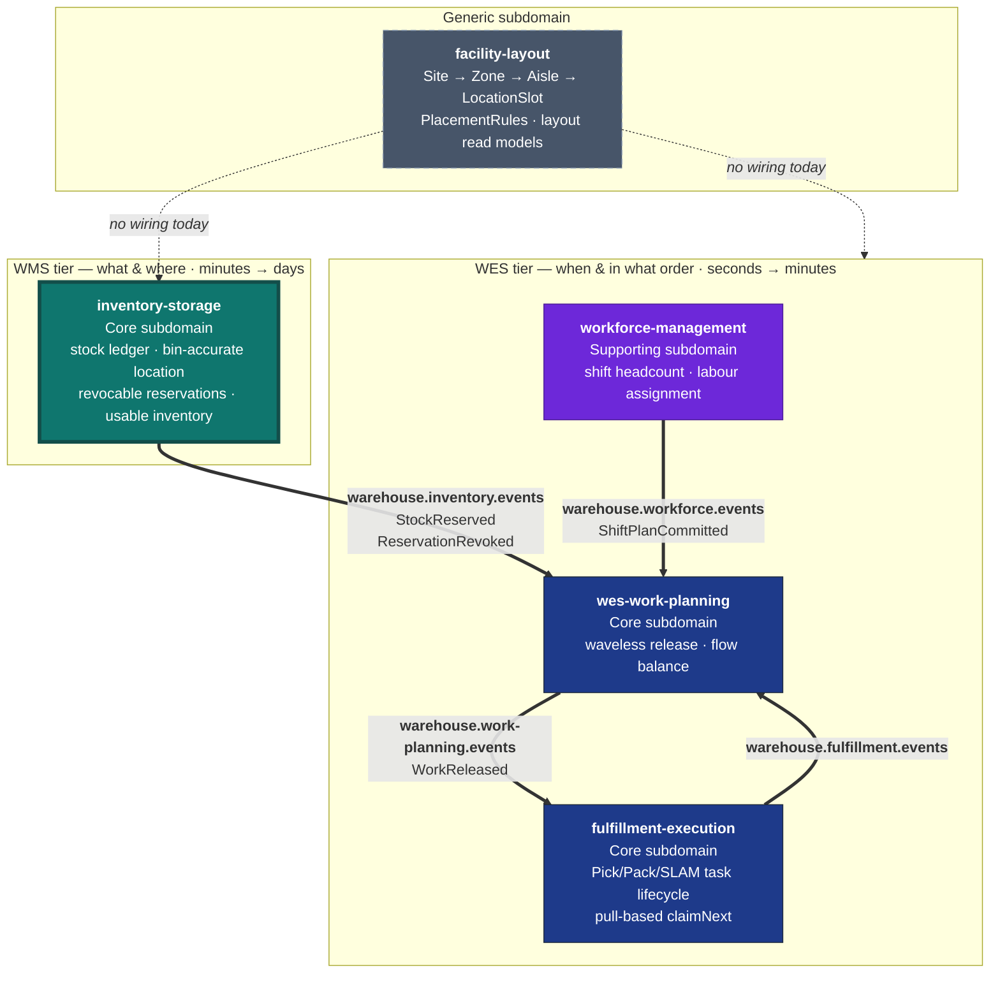

# Context Map

Five Go services, one platform. This page shows what is **actually running**
between them today, and separately what the strategic relationship is even
where no wire exists.

## The platform

**Bold edges are live Kafka topics with a real publisher and a real consumer on
each end.** Dashed edges are relationships that exist strategically and have no
code behind them.

## Verified integration inventory

Every row below was checked against the actual adapter code in each
repository, not against intent.

| Producer | Topic | Consumer | Wired? |
| --- | --- | --- | --- |
| `inventory-storage` | `warehouse.inventory.events` | `wes-work-planning` | ✅ publisher `internal/adapters/outbound/kafka/publisher.go`; consumer `wes-work-planning/internal/adapters/inbound/kafka/consumer.go` |
| `workforce-management` | `warehouse.workforce.events` | `wes-work-planning` | ✅ |
| `wes-work-planning` | `warehouse.work-planning.events` | `fulfillment-execution` | ✅ |
| `fulfillment-execution` | `warehouse.fulfillment.events` | `wes-work-planning` | ✅ |
| `facility-layout` | — | — | ❌ **no Kafka adapter exists** — only an in-process log publisher |

`inventory-storage` has **no inbound consumer at all**. It publishes and serves
HTTP; it subscribes to nothing.

## This service's edges

### → `wes-work-planning` (live)

The only integration this service participates in. Full technical detail —
envelope, payloads, smoke test — is on the
[Integration](./integration.md) page.

Strategically: **Customer/Supplier with a Conformist downstream.** This service
is the **Open Host Service** for bin-accurate location and usable inventory;
`wes-work-planning` conforms to its Published Language (the events plus the
REST API) and never gets write access to a `StockUnit`, a `Bin` or a
`Reservation`.

`warehouse-systems-ddd.md` is explicit that this boundary is an
**Anti-Corruption Layer in both directions**:

> WMS never reaches into WES's `Assignment` aggregate to pick a worker; WES
> never reaches into WMS's `Order` aggregate to check inventory truth.

Concretely, in this codebase: there is no `path_id`, no `cpt`, no `work_unit`,
no `station`, no `worker` anywhere in the domain — and `wes-work-planning`'s
`inventoryview` package holds only an observed usable count per SKU, with no
concept of a bin.

### ↔ `fulfillment-execution` (indirect)

No direct edge, by design. `fulfillment-execution` needs *work*, not stock
truth; it consumes `WorkReleased` from Work Planning. When a pick physically
completes, the accounting consequence arrives here as a deliberate
`POST /reservations/{id}/confirm-pick` command — a request with an
identity and an authorisation, not an event this service happens to overhear.

That distinction matters: consuming a `PickCompleted` event would make this
service's ledger a *follower* of another context's execution stream. Requiring
an explicit command keeps this service the one that decides whether the
consumption is legal (is the reservation active? expired? already consumed?).

### ↔ `workforce-management` (none)

No relationship, deliberately. Labour planning and inventory truth share no
concepts. This is the concrete form of the rule that worker identity,
shift patterns and real-time floor conditions must never leak into the system
of record.

### ← `facility-layout` (strategic only, **not built**)

:::info Honest status
There is **no live wiring** between `inventory-storage` and `facility-layout`.
This repository contains no consumer, no client, no dependency and no
configuration referencing it; `facility-layout` has no Kafka adapter to consume
*from*. Any diagram showing an arrow between them today would be fiction.
:::

The strategic relationship is real even though the wire is not.
`facility-layout` is a **Generic subdomain** and an **Open Host Service** for
physical warehouse structure. Its own `CLAUDE.md` positions the other four
services — this one included — as downstream **Conformists** to whatever it
publishes, and notes that actually wiring that consumption is "a separate,
later, additive task in those repos."

The reasoning for extracting it, from `facility-layout`'s own classification:

> `inventory-storage` (WMS tier) needs location validity to accept a stow;
> `wes-work-planning` / `fulfillment-execution` (WES tier) need zone/aisle
> adjacency for travel-path and congestion reasoning. Neither owns it; both
> consume it.

That is `warehouse-systems-ddd.md`'s "extract generic logic instead of
duplicating it" discipline — its Cartonization example — applied to physical
location.

**What the integration would look like, when built:** `facility-layout` becomes
the source of truth this service's `Bin` validates against. `StowStock`'s
location-scan check would consult it (is this a real, active, correctly-typed
slot?) instead of only checking that the bin exists in `LocationRepo`.
Placement policy — temperature class, hazmat, size fit — would stay in
`facility-layout`'s `PlacementRule` model and would *not* migrate here;
importing slotting policy into the stock ledger would be fixed slotting
reintroduced through the back door.

Until that exists, a `Bin` here remains an id, a capacity and an occupancy,
seeded as infrastructure data.

## Where this sits in the reference model

`amazon-fulfillment-ddd.md`'s context map places Inventory & Storage exactly
where this service sits:

> **Planning ↔ Inventory & Storage:** Customer/Supplier. Planning asks "can I
> allocate?"; Inventory is the authoritative supplier of stock + bin location
> (its Open-Host Service exposes bin-accurate location as Published Language).
>
> **Work Orchestration (WES core) is downstream** of both Planning and
> Inventory: it consumes the *plan* and the *stock reality* and turns them into
> real-time work — the "conductor."

`wes-work-planning` is that conductor. "Stock reality" is what this service
supplies to it, and `warehouse.inventory.events` is the pipe it travels down.
