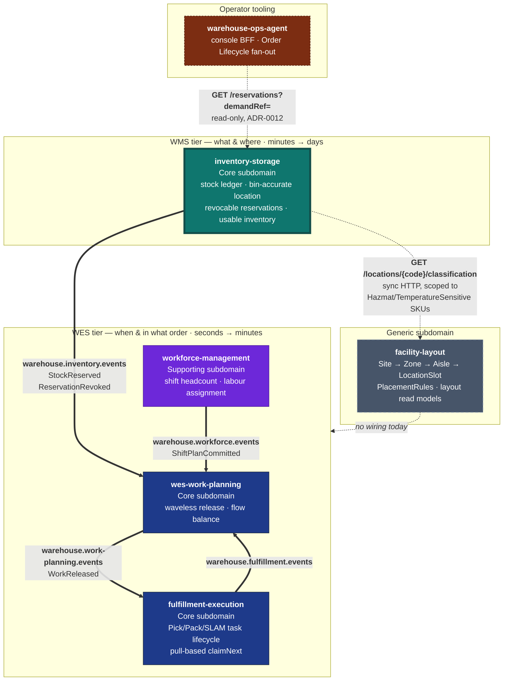

# Context Map

Five Go services, one platform. This page shows what is **actually running**
between them today, and separately what the strategic relationship is even
where no wire exists.

## The platform

**Bold edges are live Kafka topics with a real publisher and a real consumer on
each end.** Dashed edges are relationships that exist strategically and have no
code behind them.

## Verified integration inventory

Every row below was checked against the actual adapter code in each
repository, not against intent.

| Producer | Topic | Consumer | Wired? |
| --- | --- | --- | --- |
| `inventory-storage` | `warehouse.inventory.events` | `wes-work-planning` | ✅ publisher `internal/adapters/outbound/kafka/publisher.go`; consumer `wes-work-planning/internal/adapters/inbound/kafka/consumer.go` |
| `workforce-management` | `warehouse.workforce.events` | `wes-work-planning` | ✅ |
| `wes-work-planning` | `warehouse.work-planning.events` | `fulfillment-execution` | ✅ |
| `fulfillment-execution` | `warehouse.fulfillment.events` | `wes-work-planning` | ✅ |
| `facility-layout` | — | — | ❌ **no Kafka adapter exists** — only an in-process log publisher |

`inventory-storage` has **no inbound Kafka consumer at all**. It publishes and
serves HTTP; it subscribes to no topic. It does, since ADR 0009, make one
**synchronous HTTP call outward**: `StowStock` reads
`GET /locations/{locationCode}/classification` from `facility-layout` when
stowing a SKU classified `Hazmat` or `TemperatureSensitive`, gated by
`LOCATION_LOOKUP_MODE` (default `permissive`, i.e. off). This is a
request/response dependency, not a message-bus one, and does not appear in
the Kafka table above.

## This service's edges

### → `wes-work-planning` (live)

The only integration this service participates in. Full technical detail —
envelope, payloads, smoke test — is on the
[Integration](./integration.md) page.

Strategically: **Customer/Supplier with a Conformist downstream.** This service
is the **Open Host Service** for bin-accurate location and usable inventory;
`wes-work-planning` conforms to its Published Language (the events plus the
REST API) and never gets write access to a `StockUnit`, a `Bin` or a
`Reservation`.

`warehouse-systems-ddd.md` is explicit that this boundary is an
**Anti-Corruption Layer in both directions**:

> WMS never reaches into WES's `Assignment` aggregate to pick a worker; WES
> never reaches into WMS's `Order` aggregate to check inventory truth.

Concretely, in this codebase: there is no `path_id`, no `cpt`, no `work_unit`,
no `station`, no `worker` anywhere in the domain — and `wes-work-planning`'s
`inventoryview` package holds only an observed usable count per SKU, with no
concept of a bin.

### ↔ `fulfillment-execution` (indirect)

No direct edge, by design. `fulfillment-execution` needs *work*, not stock
truth; it consumes `WorkReleased` from Work Planning. When a pick physically
completes, the accounting consequence arrives here as a deliberate
`POST /reservations/{id}/confirm-pick` command — a request with an
identity and an authorisation, not an event this service happens to overhear.

That distinction matters: consuming a `PickCompleted` event would make this
service's ledger a *follower* of another context's execution stream. Requiring
an explicit command keeps this service the one that decides whether the
consumption is legal (is the reservation active? expired? already consumed?).

### ↔ `workforce-management` (none)

No relationship, deliberately. Labour planning and inventory truth share no
concepts. This is the concrete form of the rule that worker identity,
shift patterns and real-time floor conditions must never leak into the system
of record.

### → `warehouse-ops-agent`'s console BFF (read-only, via `inventory-mfe`)

Per [ADR-0012](/docs/adr/0012-adopt-mfe-console-architecture) (this
service's adoption record for `warehouse-ops-agent`'s own ADR-0002, the
fleet's micro-frontend console architecture): this service ships
`inventory-mfe`, a Module Federation remote (`web/`) that talks only to
this service's own REST API, plus one additive read,
`GET /reservations?demandRef=`, that closes the join-key gap ADR-0002
identified. `warehouse-ops-agent`'s BFF calls that same endpoint as one leg
of its cross-service Order Lifecycle fan-out. This is a **read-only,
inbound HTTP edge** — the browser (via `inventory-mfe`) and the BFF are
callers of this service's existing REST surface, not a new dependency this
service takes on anything else. CORS middleware (`CORS_ALLOWED_ORIGINS`) is
the only new surface this adoption added; no domain model, aggregate, or
pre-existing endpoint changed.

### ← `facility-layout` (partial: live synchronous read, no event wiring)

:::info Status as of ADR 0009
There is now **one live wire** between `inventory-storage` and
`facility-layout`: a synchronous HTTP read, `GET
/locations/{locationCode}/classification`, called from `StowStock` to
enforce hazmat/temperature-class placement rules (see
[ADR 0009](/docs/adr/0009-product-classification-as-sku-master-data)).
There is still **no Kafka wiring** in either direction — this is a request/
response dependency, not an event subscription, and it is scoped: only SKUs
this service has classified `Hazmat` or `TemperatureSensitive` trigger the
call at all, and it is disabled by default (`LOCATION_LOOKUP_MODE=permissive`).
:::

The strategic relationship goes further than this one endpoint.
`facility-layout` is a **Generic subdomain** and an **Open Host Service** for
physical warehouse structure. Its own `CLAUDE.md` positions the other four
services — this one included — as downstream **Conformists** to whatever it
publishes, and notes that actually wiring that consumption is "a separate,
later, additive task in those repos." ADR 0009 is the first slice of that
task landing here: a single read, for a single, narrow purpose.

The reasoning for extracting it, from `facility-layout`'s own classification:

> `inventory-storage` (WMS tier) needs location validity to accept a stow;
> `wes-work-planning` / `fulfillment-execution` (WES tier) need zone/aisle
> adjacency for travel-path and congestion reasoning. Neither owns it; both
> consume it.

That is `warehouse-systems-ddd.md`'s "extract generic logic instead of
duplicating it" discipline — its Cartonization example — applied to physical
location.

**What ADR 0009 did NOT do:** `StowStock`'s location-scan check still only
confirms the bin exists in this service's own `LocationRepo` — it does not
validate the bin against facility-layout's location catalog as "real,
active, correctly-typed." The new call is narrowly scoped to hazmat/
temperature placement policy, sourced from `Zone.Hazmat` /
`Zone.TemperatureClass`, for classified SKUs only. General location
validity, and any placement policy for `Oversized`/`HighValue`/`Fragile`
tags, remains unbuilt and would be a further, separate extension of this
same edge.

A `Bin` here remains an id, a capacity and an occupancy, seeded as
infrastructure data — this ADR did not change that.

## Where this sits in the reference model

`amazon-fulfillment-ddd.md`'s context map places Inventory & Storage exactly
where this service sits:

> **Planning ↔ Inventory & Storage:** Customer/Supplier. Planning asks "can I
> allocate?"; Inventory is the authoritative supplier of stock + bin location
> (its Open-Host Service exposes bin-accurate location as Published Language).
>
> **Work Orchestration (WES core) is downstream** of both Planning and
> Inventory: it consumes the *plan* and the *stock reality* and turns them into
> real-time work — the "conductor."

`wes-work-planning` is that conductor. "Stock reality" is what this service
supplies to it, and `warehouse.inventory.events` is the pipe it travels down.
