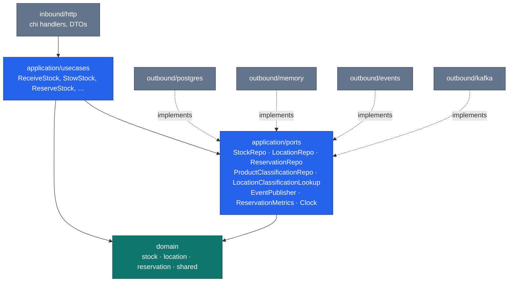

# Architecture

The service is **hexagonal (ports & adapters)** with one non-negotiable rule:

> **domain depends on nothing; application depends on domain; adapters depend
> on application/domain.**

No framework type, no `chi` router, no `pgx` connection, and no SQL string ever
appears inside `internal/domain/`.

## Layout

```text
cmd/inventory/               main.go — composition root (OLTP REST API)
cmd/inventory-projector/     analytics writer (ADR 0011)
cmd/inventory-reports/       analytics read-only report REST (ADR 0011)
cmd/mcp/                     MCP server, Streamable HTTP (ADR 0008)
internal/
  domain/                    pure Go — no framework, no SQL types
    location/                Bin aggregate (capacity, occupancy)
    stock/                   StockUnit aggregate (SKU@bin, qty, state)
    reservation/             Reservation aggregate (revocable, timeout)
    product/                 ProductClassification aggregate + DOT segregation
    shared/                  SKU, BinId, Quantity value objects; domain events
  analytics/report/          analytics read-model region (imports no OLTP code)
  application/
    ports/                   OUT interfaces (see Ports below)
    usecases/                one struct per use case
  adapters/
    inbound/http/            chi handlers, DTOs, RFC 7807 error mapping; reports REST
    inbound/kafka/           analytics-topic consumer (projector)
    inbound/mcp/             MCP tools, resources and prompts
    outbound/postgres/       pgxpool repos + golang-migrate migrations
    outbound/memory/         thread-safe in-memory repos (tests, local dev)
    outbound/events/         log, buffered and multi (fan-out) publishers
    outbound/kafka/          integration + analytics publishers (kafka-go)
    outbound/analyticsstore/ analytical Postgres projection + reader
    outbound/facilitycache/  Kafka-fed facility-layout location cache (ADR 0013)
    outbound/facilitylayout/ sync HTTP + permissive location lookups
    outbound/telemetry/      OTel setup, trace-aware slog, metrics
  architecture/              arch-go fitness tests encoding the rule above
migrations/                  golang-migrate SQL files (OLTP)
migrations/analytics/        golang-migrate SQL files (analytical DB)
apis/                        openapi.yaml + asyncapi.yaml (Spectral-linted)
features/                    Gherkin acceptance specs (godog)
charts/inventory-storage/    Helm chart
web/                         inventory_mfe Module Federation remote
```

## The dependency flow



Solid arrows are compile-time imports; dashed arrows are interface
satisfaction. Note that **no arrow points from the application layer into an
adapter** — the application only ever names an interface in
`application/ports`, and `cmd/inventory/main.go` is the only place that decides
which implementation gets plugged in.

## The rule is executable, not aspirational

`internal/architecture/architecture_test.go` uses
[arch-go](https://github.com/arch-go/arch-go) to assert the layering as a
normal Go test, and CI runs it as a blocking `arch-test` job. The rules it
encodes:

1. `internal/domain/...` must not import any other `internal/...` package.
2. `internal/application/...` must not import `internal/adapters/...`.
3. `internal/adapters/inbound/...` must not import
   `internal/adapters/outbound/...` (and vice versa).
4. Only `cmd/...` may import adapters *and* application together.

If someone reaches from a use case into `pgx` for a "quick fix," the build goes
red. See [ADR 0006](/docs/adr/0006-arch-go-fitness-tests).

## Ports

| Port | Responsibility | Implementations |
| --- | --- | --- |
| `StockRepo` | Persist/retrieve `StockUnit`; find by ID, SKU, bin; mint IDs | `postgres`, `memory` |
| `LocationRepo` | Persist/retrieve `Bin` | `postgres`, `memory` |
| `ReservationRepo` | Persist/retrieve `Reservation`; mint IDs | `postgres`, `memory` |
| `ProductClassificationRepo` | Persist/retrieve `ProductClassification` by SKU | `postgres`, `memory` |
| `LocationClassificationLookup` | Zone attributes (hazmat, temperature class) for a bin, for stow placement rules | `facilitycache` (Kafka-fed cache), `facilitylayout` (sync HTTP client, permissive stub) |
| `EventPublisher` | Publish a `shared.DomainEvent` | `events` (log/buffered/multi fan-out), `postgres` (append-only `events` table), `kafka` (integration + analytics) |
| `ReservationMetrics` | Count reservations created/revoked (`inventory.reservations`) | `telemetry` |
| `Clock` | `Now()` — makes reservation timeouts deterministic in tests | `memory.SystemClock`, fixed clocks in tests |

The `Clock` port matters more than it looks: reservation expiry is a *domain*
concept, so time must be injected rather than read from `time.Now()` inside an
aggregate. Every domain event's `occurredAt` comes from that injected clock.

## Composition root

`cmd/inventory/main.go` is the only file that knows both an interface and its
implementation, and reads almost all configuration (the exceptions are
`CORS_ALLOWED_ORIGINS`, read by the HTTP adapter, and `ENVIRONMENT`, read by
the telemetry adapter):

| Env var | Default | Effect |
| --- | --- | --- |
| `HTTP_ADDR` | `:8080` | Listen address |
| `DATABASE_URL` | *(unset)* | If unset, the in-memory adapters are used and no database is required. If set, migrations run and the Postgres adapters are wired. |
| `MIGRATIONS_PATH` | `migrations` | Where golang-migrate looks for SQL files |
| `EVENT_PUBLISHER` | `log` | `kafka` swaps in the integration + analytics publishers (fan-out) |
| `KAFKA_BROKERS` | `localhost:9092` | Comma-separated broker list |
| `LOCATION_LOOKUP_MODE` | `permissive` | `kafka` (Kafka-fed facility-layout cache; requires `KAFKA_BROKERS`), `http` (sync call), or `permissive` (no lookup) |
| `FACILITY_LAYOUT_BASE_URL` | *(unset)* | facility-layout base URL for `LOCATION_LOOKUP_MODE=http` |
| `OTEL_SERVICE_NAME` / `OTEL_EXPORTER_OTLP_ENDPOINT` / `SERVICE_VERSION` / `LOG_LEVEL` | `inventory-storage` / `localhost:4317` / `dev` / `info` | Telemetry and logging |

The in-memory fallback is deliberate: `go run ./cmd/inventory` with no
environment at all starts a fully functional service, which is what makes the
`httptest` suite and the godog acceptance suite cheap to run.

## Quality gates

Everything below runs in `.github/workflows/ci.yml` on every push and pull
request:

| Job | What it enforces |
| --- | --- |
| `lint` | `golangci-lint` against the committed `.golangci.yml` |
| `test` | Unit tests with `-race`; coverage gate on domain + application |
| `bdd` | godog acceptance suite over the Gherkin specs in `features/` |
| `integration` | Real Postgres 16 service container for the Postgres adapters; testcontainers-started Kafka for the facility-layout cache consumer |
| `mutation-fast` | `gremlins` on `internal/domain/stock` — blocking |
| `mutation` | `gremlins` on all of `internal/domain` (scheduled/dispatch only) |
| `drift` | Dead code, `go mod tidy -diff`, knip, coverage quality (scheduled/dispatch only, advisory) |
| `api-lint` | Spectral against `apis/openapi.yaml` **and** `apis/asyncapi.yaml` |
| `vuln` | `govulncheck ./...` |
| `docs-api-drift` | Regenerates the REST reference from `apis/openapi.yaml` and fails on any diff |
| `helm-lint` | `ct lint` against `charts/inventory-storage` (pull requests) |
| `arch-test` | The hexagonal fitness tests above |
| `web` | Lint, typecheck, test and build of the `web/` remote |
| `trivy-scan` | Container image scan, blocking on fixable CRITICAL/HIGH (pull requests) |
| `docker-publish` | Gated on `lint`, `test`, `bdd`, `integration`, `mutation-fast`, `vuln`, `api-lint`, `arch-test`; pushes to Docker Hub on `main` only |

This documentation site is built and deployed by a separate workflow,
`.github/workflows/docs.yml`, which never touches `ci.yml`.
