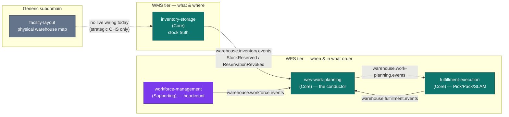

# Inventory & Storage

:::warning[Study project]
This documentation site is an educational Domain-Driven Design exercise. It
follows real industry-standard patterns and terminology, but it is **not a
production system** and is **not affiliated with, endorsed by, or
representative of Amazon or any other company**.
:::

**Inventory & Storage** is the WMS-tier authoritative record of *what is held
where, and what portion of it is usable*.

It is one of five Go services that make up the `warehouse-systems` platform.
This one sits in the **WMS tier** (the "what and where" layer) and is a **Core
subdomain**: it owns inventory truth. Everything else on the platform — work
planning, labour, task execution — asks this service what stock reality is,
and none of them are allowed to write to its aggregates.

## The one sentence that explains the design

> Every physical item has exactly one known bin, **or** it is flagged
> `Unlocated`.

That is the invariant the whole bounded context exists to protect. Chaotic
stow, the item-scan + location-scan rule, cycle counting, and the `Unlocated`
state are all consequences of taking that sentence literally.

## What it owns

| Capability | What that means here |
| --- | --- |
| **Stock ledger** | `StockUnit` aggregates — a quantity of a SKU at a specific bin, with a lifecycle state. |
| **Bin-accurate location** | Chaotic (random) stow: any SKU may occupy any free bin; the system records the exact bin it landed in. |
| **Capacity enforcement** | A `Bin` has a capacity; the sum of stock stowed into it may never exceed that capacity. |
| **Revocable reservations** | Allocation is a `Reservation` with a timeout that can always be revoked and re-satisfied from a different physical holding. |
| **Usable inventory** | The read model that actually constrains release: on-hand minus active reservations minus held/unlocated stock. |
| **Cycle counting** | Verifying a bin's physical contents against system records, reconciling shortfalls by flagging stock `Unlocated`. |

## What it deliberately does not own

Naming the boundary is as important as naming the capability. This service:

- **does not pick, pack, ship, or route associates** — that is
  `fulfillment-execution` (task lifecycle) and `wes-work-planning` (release
  and flow balance);
- **does not plan labour or headcount** — that is `workforce-management`;
- **does not model the physical building** (site, area, zone, aisle, bay,
  level, position) — that is `facility-layout`, a separate Generic subdomain;
- **does not decide what to buy or forecast demand** — that is upstream of the
  whole platform;
- **does not create bins over HTTP** — bin provisioning is seed-data /
  infrastructure today, not an exposed operation.

Per `warehouse-systems-ddd.md`, keeping worker identity, real-time floor
conditions and task sequencing *out* of the inventory system of record is what
lets that record stay stable and auditable while labour policy changes weekly.

## How the five services fit together

The dotted edge is honest: `facility-layout` exists, but nothing in this
repository consumes it yet. See [the context map](/docs/ecosystem/context-map)
for the full relationship analysis.

## Where to go next

- **[Architecture](./architecture.md)** — the hexagonal layering and the strict
  dependency rule, enforced by executable fitness tests.
- **[Quickstart](./quickstart.md)** — run the service and exercise every
  endpoint with `curl`.
- **[Domain vision](/docs/business-context/domain-vision)** — why this service
  exists in this shape.
- **[API Reference](/docs/api-reference)** — generated from the real,
  Spectral-linted `apis/openapi.yaml`.
- **[ADRs](/docs/adr)** — the consequential decisions, in Nygard format.
